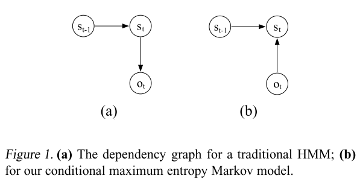
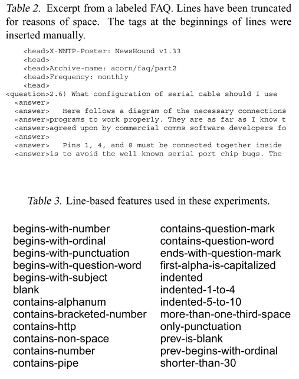

# Maximum Entropy Markov Models for Information Extraction and Segmentation - McCallum et al - 2000

## [Paper](http://www.ai.mit.edu/courses/6.891-nlp/READINGS/maxent.pdf)

# tl;dr

This paper presents a new Markovian sequence model, closely related to HMMs, that allows observations to be represented as arbitrary overlapping features (such as word, capitalization, formatting, part-of-speech), and defines the conditional probability of state sequences given observation sequences.

# Introduction

Hidden Markov models (HMMs) are a powerful tool for representing sequential data, and have been applied with significant success to many text-related tasks.

There are two problems with this traditional approach:

- Many tasks would benefit from a richer representation of observations. Furthermore, in some applications the set of all possible observations is not reasonably enumerable.
- The traditional approach inappropriately uses a generative joint model in order to solve a conditional problem in which the observations are given.

This paper introduces maximum entropy Markov models (MEMMs), which address both of these concerns. To allow for non-independent, difficult to enumerate observation features, we move away from the generative, joint probability parameterization of HMMs to a conditional model that represents the probability of reaching a state given an observation and the previous state.

# Model

## HMM

A sequence of observations is produced by starting in some state, emitting an observation selected
by that state, transitioning to a new state, emitting another observation - and so on until a designated final state is reached.

In a supervised task, such as information extraction, there is a sequence of labels
attached to each training observation sequence. To label an unlabeled observation sequence, the Viterbi path is calculated, and the labels associated with that path are returned.

## MEMM

In MEMM, the HMM transition and observation functions are replaced by a single function that provides the probability of the current state given the previous state and the current observation.

In this model, the observations are *given* - reflecting the fact that we don’t actually care about their probability, only the probability of the state sequence (and hence label sequence) they induce. In contrast to HMMs, in which the current observation only depends on the current state, the current observation in an MEMM may also depend on the previous state.

### State Estimation from Observations

There is still an efficient dynamic programming solution the classic problem of identifying the most likely state sequence given an observation sequence.

The Viterbi algorithm for HMMs fills in a dynamic programming table with forward probabilities defined as the probability of producing the observation sequence up to time *t* **and** being in state *s* at time *t*.

In the new model, we redefine the dynamic programming table to be the probability of being in state *s* at time *t* **given** the observation sequence up to time *t*.

### An Exponential Model for Transitions

The use of state-observation transition functions rather than the separate transition and observation functions in HMMs allows us to model transitions in terms of multiple, non-independent features of observations, which we believe to be the most valuable contribution of the present work. To do this, we turn to exponential models fit by maximum entropy, which is a framework for estimating probability distributions from data.

### Variations

One interesting variation:

Rather than combining the transition and emission parameters in a single function, the transition probabilities could be represented as a traditional multinomial, and the influence of the observations could be represented by a maximum-entropy exponential.

Note here that the observation and the previous state are treated as independent evidence for the current state. This approach would put the observations back in the states instead of the transitions.

# Experimental Results

We tested our method on a collection of 38 files belonging to 7 Usenet multi-part FAQs downloaded from the Internet.

We labeled each line in this document collection into one of four categories, according to its role in the document: head, question, answer, tail, corresponding to the parts of documents described in the previous paragraph. The object of the task is to recover these labels.

We defined 24 Boolean features of lines, shown in Table 3, which we believed would be useful in determining the class of a line.

The results presented in this section are meant to answer
the question of how well can a MEMM trained on a single
manually labeled document label novel documents formatted according to the same conventions.

We tested four different models on this dataset:

- ME-Stateless: A single maximum entropy classifier trained on and applied to each line independently, using the 24 features shown in Table 3.
- TokenHMM: A traditional, fully connected HMM with four states, one for each of the line categories.
- FeatureHMM: Identical to TokenHMM, only the lines in a document are first converted to sequences of features from Table 3. For every feature that tests true for a line, a unique symbol is inserted into the corresponding line in the converted document. The HMM is trained to emit these symbols.
- MEMM: The maximum entropy Markov model described in this paper.

The results support two claims that underpin our research into this problem:

- Representing lines in terms of features salient to the problem at hand is far more effective than a token-level representation, which is the essential difference between *TokenHMM* and *FeatureHMM.*
- For the purposes of segmentation, the results suggest that it is more important to model structure than to have access to line features.
