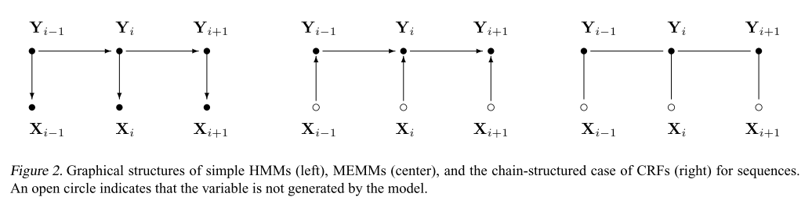
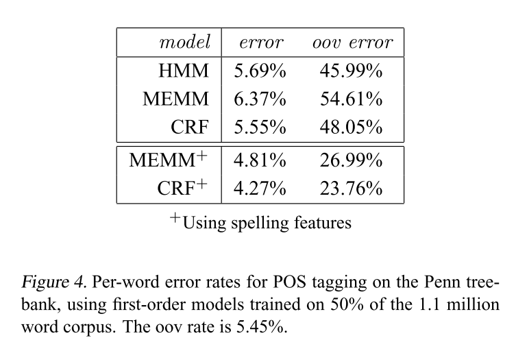

# Conditional Random Fields: Probabilistic Models for Segmenting and Labeling Sequence Data - Lafferty et al - 2001

## 📌 [Paper](https://repository.upenn.edu/cgi/viewcontent.cgi?article=1162&context=cis_papers)

# tl;dr

This paper presents *conditional random fields (CRFs)*, a framework for building probabilistic models to segment and label sequence data. They offer several advantages over hidden Markov models (HMMs) and stochastic grammars for such tasks, including the ability to relax strong independence assumptions made in those models and also avoid a fundamental limitation of discriminative Markov models based on directed graphical models, which can be biased towards states with few successor states.

# Introduction

The need to segment and label sequences arises in many different problems in several scientific fields:

- Computational biology:
    - align biological sequences
    - find sequences homologous to a known evolutionary family
    - analyze RNA secondary structure
- Computational linguistics
    - topic segmentation
    - POS tagging
    - information extraction
    - syntactic disambiguation

HMMs and stochastic grammars are widely used probabilistic models for such problems. They are generative models, assigning a joint probability to paired observation and label sequences. It is not practical to represent multiple interacting features or long-range dependencies of the observations, since the inference problem for such models is intractable.

This difficulty is one of the main motivations for looking at conditional models as an alternative. A conditional model specifies the probabilities of possible label sequences given an observation sequence. The conditional probability of the label sequence can depend on arbitrary, non-independent features of the observation sequence without forcing the model to account for the distribution of those dependencies.

MEMMs are conditional probabilistic sequence models that attain all of the above advantages: each source state has a exponential model that takes the observation features as input, and outputs a distribution over possible next states.

The above model has a weakness we call here the label bias problem: the transitions leaving a given state compete only against each other, rather than against all other transitions in the model. All the mass that arrives at a state must be distributed among the possible successor states. An observation can affect which destination states get the mass, but not how much total mass to pass on.

This paper introduces conditional random fields (CRFs), a sequence modeling framework that has all the advantages of MEMMs but also solves the label bias problem in a principled way. The critical difference between CRFs and MEMMs is that a MEMM uses per-state exponential models for the conditional probabilities of next states given the current state, while a CRF has a single exponential model for the joint probability of the entire sequence of labels given the observation sequence.

# The Label Bias Problem

States with low-entropy next state distributions will take little notice of observations. Thus, states with a single outgoing transition effectively ignore their observations.

Proper solutions require models that account for whole state sequences at once by letting some transitions “vote” more strongly than others depending on the corresponding observations.

# Conditional Random Fields

In what follows, **X** is a random variable over data sequences to be labeled, and **Y** is a random variable over corresponding label sequences. All components **Yi** of **Y** are assumed to range over a finite label alphabet **W**. For example, **X** might range over natural language sentences and **Y** range over part-of-speech taggings of those sentences, with **W** the set of possible part-of-speech tags.

A CRF is a random field globally conditioned on the observation **X**.

Although CRFs encompass HMM-like models, the class of conditional random fields is much more expressive, because it allows arbitrary dependencies on the observation sequence. In addition, the features do not need to specify completely a state or observation, so one might expect that the model can be estimated from less training data. Another attractive property is the convexity of the loss function; indeed, CRFs share all of the convexity properties of general maximum entropy models.

# Experiments

We first discuss two sets of experiments with synthetic data that highlight the differences between CRFs and MEMMs:

1. Direct verification of the label bias problem:
    - In a typical run using 2000 training and 500 test samples, trained to convergence of the iterative scaling algorithm, the CRF error is 4.6% while the MEMM error is 42%
2. Generate synthetic data using randomly chosen hidden Markov models, each of which is a mix-ture of a first-order and second-order model:
    - As the data becomes more second-order, the test error rates of the trained models increase
    - This experiment corresponds to the common modeling practice of approximating complex local and long-range dependencies, as occur in natural data, by small-order Markov models
    - Results clearly indicate that even when the models are parameterized in exactly the same way, CRFs are more robust to inaccurate modeling assumptions than MEMMs or HMMs

We also compared HMMs, MEMMs and CRFs on Penn treebank POS tagging, where each word in a given input sentence must be labeled with one of 45 syntactic tags. We confirm the advantage of CRFs over MEMMs. We also show that the addition of overlapping features to CRFs and MEMMs allows them to perform much better than HMMs, as already shown for MEMMs by McCallum et al.

We carried out two sets of experiments with this natural language data:

1. We trained first-order HMM, MEMM, and CRF models as in the synthetic data experiments
    - The results are consistent with what is observed on synthetic data: the HMM outperforms the MEMM, as a consequence of the label bias problem, while the CRF outperforms the HMM
2. We take advantage of the power of conditional models by adding a small set of orthographic features: whether a spelling begins with a number or upper case letter, whether it contains a hyphen, and whether it ends in one of the following suffixes: -ing, - ogy, -ed, -s, -ly, -ion, -tion, -ity, -ies
    - Both the MEMM and the CRF benefit significantly from the use of these features,

# Conclusion

Conditional random fields offer a unique combination of properties:

- Discriminatively trained models for sequence segmentation and labeling
- Combination of arbitrary, overlapping and agglomerative observation features from both the past and future
- Efficient training and decoding based on dynamic programming
- Parameter estimation guaranteed to find the global optimum.

Their main current limitation is the slow convergence of the training algorithm relative to MEMMs.