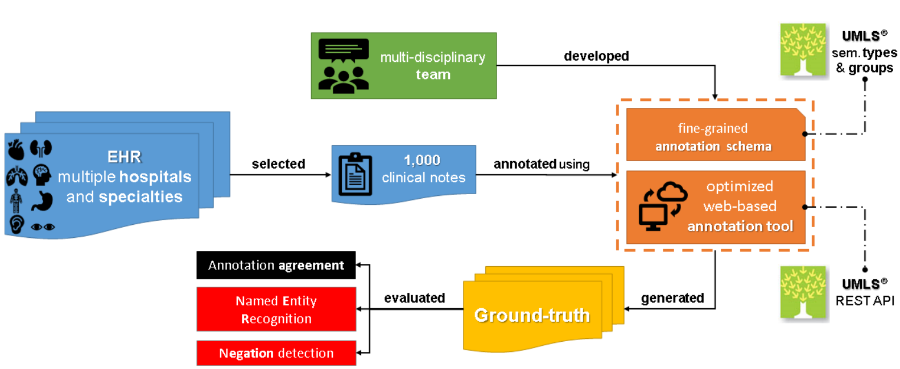

# SemClinBr – a multi-institutional and multi-specialty semantically annotated corpus for Portuguese clinical NLP tasks - Oliveira et al - 2020

## [Paper](https://arxiv.org/pdf/2001.10071.pdf)

# tl;dr

We developed a semantically annotated corpus using clinical texts from multiple medical specialties, document types, and institutions. The result of this work is the SemClinBr which has 1,000 clinical notes, labeled with 65,117 entities and 11,263 relations.

# Highlights

- A survey described the essential aspects and lessons learned regarding biomedical semantic annotation
- A fine-grained and replicable annotation schema was defined
- An optimized web-based annotation tool supported the annotation process
- The intrinsic and extrinsic evaluation of the corpus corroborate its application in different clinical NLP tasks

# Introduction

Aiming to structure a background to support the biomedical NLP field for pt-br language and address the gaps of broad scope/in-depth clinical corpora outside English scope, we developed a semantically annotated corpus to assist clinical NLP tasks, both in its evaluation and in its development.

# Related Work

To realize cohesive, reliable, unbiased, and fast annotations, most studies share the following common steps:

- double annotation → to reduce bias and improve reliability
- guidelines/scheme definition → to improve reliability and support annotators
- annotation agreement measures → to ensure reliability
- use of an annotation tool → to ease/speed up the annotation work
- annotation characterization (e.g., semantic type, relations) based on the desired task → for better scope definition

# Data preparation

Our data are obtained from two different data sources:

1. a corpus of 2,094,929 entries from a group of hospitals in Brazil between 2013 and 2018
2. a corpus of 5,617 entries from a University Hospital between 2002 and 2007

The data configuration has structured data (i.e., gender, birth date, begin data, end date) and just one free-text data field

## Document selection

We selected almost 500 clinical notes from cardiology and nephrology specialties. Owing to the lack of corpora for pt-br, we randomly selected documents from other medical areas to complete 1,000 clinical narratives.

# Annotation schema

## Annotation guidelines

We opted to use the [UMLS semantic types](https://www.nlm.nih.gov/research/umls/META3_current_semantic_types.html) (STY) as our annotation tags (e.g., "Body Location or Region", "Sign or Symptom", "Clinical Attribute"). We add two more types in our tagset, the "Negation" and "Abbreviation" tags.

Sometimes, when we want to extract semantic meaning from clinical text, the semantic value of a concept alone is not enough to infer important events and situations. Hence, **we incorporated the annotation of relations between clinical concepts to the guidelines**. The relation annotation schema was partially derived from the [UMLS Relationship Hierarchy](https://www.nlm.nih.gov/research/umls/new_users/online_learning/SEM_004.html). The RTYs included only the "associated_with" and "negation_of" RTYs.

## Annotation tool

We decided to build our own tool, which is reported on [Oliveira et al. (2017)](http://www.sadidhasan.com/sadid-BIBM-umls.pdf).

# Annotation results and analysis

## Corpus statistics

Our corpus comprehended 100 UMLS semantic types representing the entities, 2 extra semantic types typifying Abbreviations and Negations, and 2 relationship types defining the relations between clinical entities.

The annotation process was 100% double-annotated and adjudicated, and lasted 14 months, resulting in a corpus composed of 1,000 documents (148,033 tokens), with 65,129 entities and 11,263 relations labeled. 

## Bio-NLP tasks application

The functionality of an annotated corpus can be tested by applying it in a downstream NLP task.

### Negation detection

To train and assess Dalloux et al. (2020) method in the pt-br clinical scope, they used a segment of our corpus with the negation-related annotations. This includes not only the negation cue labeled with the "Negation" STY, but the concepts related to it using the relation "Negation_of" so that detecting the negation scope would be possible.

### Clinical named entity recognition

[Souza et al. (2019)](https://sol.sbc.org.br/index.php/sbcas/article/view/6269) describe their preliminary work with promosing results on exploring CRF algorithms to perform NER in clinical pt-br texts.