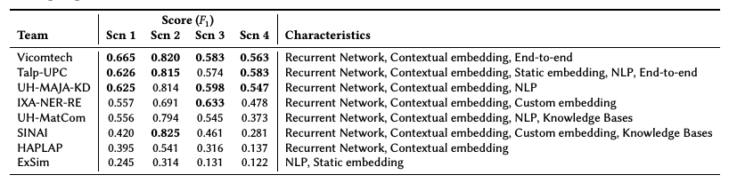

# Overview of the eHealth Knowledge Discovery Challenge at IberLEF 2020 - Piad-Morffis et al. - 2020

## 📌 [Original paper](http://ceur-ws.org/Vol-2664/eHealth-KD_overview.pdf)
## 📌 [Paper with annotation](paper_with_annotation/Piad-Morffis_et_al.-Overview_of_the_eHealth_Challenge-annotation_pavalucas.pdf)

# tl;dr

The eHealth-KD challenge proposes two computational tasks involving the identification of semantic entities and relations in natural language text, focusing on Spanish language health documents.