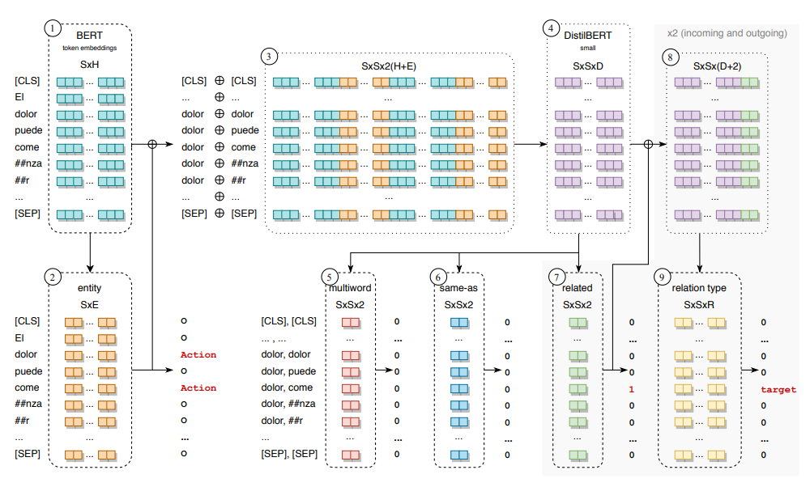

# Vicomtech at eHealth-KD Challenge 2020: Deep End-to-End Model for Entity and Relation Extraction in Medical Text - García-Pablos et al. - 2020

## 📌 [Original paper](http://ceur-ws.org/Vol-2664/eHealth-KD_paper3.pdf)

## 📌 [Paper with annotation](paper_with_annotation/Garca-Pablos_et_al.-Vicomtech_eHealth_Challenge_2020-annotation_pavalucas.pdf)

# tl;dr

A single end-to-end deep neural network with pre-trained BERT models, which models the whole problem jointly. It has achieved the first position in the main scenario of the competition and top-3 in the rest of scenarios.