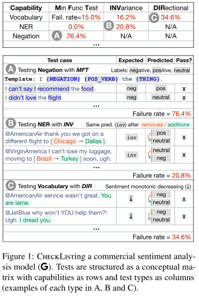
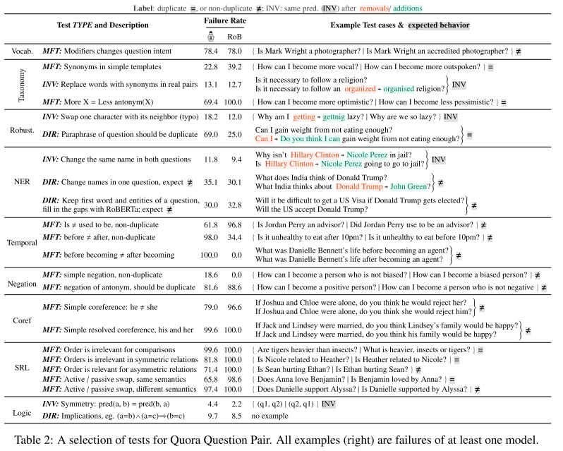

# Beyond Accuracy: Behavioral Testing of NLP Models with CheckList - Ribeiro et al - 2020

## [Paper](https://arxiv.org/abs/2005.04118)

# tl;dr

We introduce CheckList, a task-agnostic methodology for testing NLP models. CheckList includes a matrix of general linguistic capabilities and test types that facilitate comprehensive test ideation, as well as a software tool to generate a large and diverse number of test cases quickly.

# Introduction

One of the primary goals of training NLP models is generalization.

The standard paradigm for evaluation is using train-validation-test splits to estimate the accuracy of
the model. While performance on held-out data is a useful indicator, held-out datasets are often not comprehensive, and contain [the same biases as the training data](https://www.aclweb.org/anthology/P18-2124/), such that real-world performance may be overestimated.

Software engineering research, on the other hand, has proposed a variety of paradigms and tools for testing complex software systems. In particular, “behavioral testing” (also known as [black-box testing](https://www.amazon.com.br/dp/B003VIWZ7E/ref=dp-kindle-redirect?_encoding=UTF8&btkr=1)) is concerned with testing different capabilities of a system by validating the input-output behavior, without any knowledge of the internal structure.

In this work, we propose *[CheckList](https://github.com/marcotcr/checklist)*, a new evaluation methodology and accompanying tool for comprehensive behavioral testing of NLP models.

We demonstrate the usefulness and generality of *CheckList* via instantiation on three NLP tasks:

- Sentiment analysis (*Sentiment*)
- Duplicate question detection (*[QQP](https://openreview.net/forum?id=rJ4km2R5t7)*)
- Machine comprehension (*[MC](https://www.aclweb.org/anthology/D16-1264/)*)

While traditional benchmarks indicate that models on these tasks are as accurate as humans, *CheckList* reveals a variety of severe bugs, where commercial and research models do not effectively handle basic linguistic phenomena such as negation, named entities, coreferences, semantic role labeling, etc.

# CheckList

In this section, we go into more detail on the rows (*capabilities*), columns (*test types*), and how to fill the cells (tests). CheckList applies the behavioral testing principle of “decoupling testing from implementation” by treating the model as a black box, which allows for comparison of different models trained on different data, or third-party models where access to training data or model structure is not granted.

## Capabilities

CheckList encourages users to consider how different natural language capabilities are manifested on the task at hand, and to create tests to evaluate the model on each of these capabilities.

We suggest that users consider at least the following capabilities:

- **Vocabulary+POS**: important words or word types for the task
- **Taxonomy**: synonyms, antonyms, etc
- **Robustness**: to typos, irrelevant changes, etc
- **NER**: appropriately understanding named entities
- **Fairness**
- **Temporal**: understanding order of events
- **Negation**
- **Coreference**
- **Semantic Role Labeling**: understanding roles such as agent, object, etc
- **Logic**: ability to handle symmetry, consistency, and conjunctions

## Test Types

We prompt users to evaluate each capability with three different test types (when possible):

### Minimum Functionality test (MFT)

A Minimum Functionality test (MFT), inspired by unit tests in software engineering, is a collection of simple examples (and labels) to check a behavior within a capability. MFTs are similar to creating small and focused testing datasets, and are particularly useful for detecting when models use shortcuts to handle complex inputs without actually mastering the capability.

### Invariance test (INV)

An Invariance test (INV) is when we apply label-preserving perturbations to inputs and expect the model prediction to remain the same.

### Directional Expectation test (DIR)

A Directional Expectation test (DIR) is similar, except that the label is expected to change in a certain way e.g. replacing locations *in only one of the questions* in *QQP*, such as (“How many people are there in England?”, “What is the population of [England] → [Turkey]?”), ensures that the questions are not duplicates.

---

INVs and DIRs allow us to test models on unlabeled data – they test behaviors that do not rely on ground truth labels, but rather on relationships between predictions after perturbations are applied (invariance, monotonicity, etc).

## Generating Test Cases at Scale

Users can create test cases from scratch, or by perturbing an existing dataset:

- **Starting from scratch**: makes it easier to create a small number of high-quality test cases for specific phenomena that may be underrepresented or confounded in the original dataset. Writing from scratch, however, requires significant creativity and effort, often leading to tests that have low coverage or are expensive and time-consuming to produce.
- **Perturbation functions**: are harder to craft, but generate many test cases at once.

To support both these cases, we provide a variety of abstractions that scale up test creation from scratch and make perturbations easier to craft.

### Templates

Test cases and perturbations can often be generalized into a template, to test the model on a more diverse set of inputs. In Figure 1 we generalized “I didn’t love the food.” with the template:

“I {NEGATION} {POS_VERB} the {THING}.”

where:

- {NEGATION} = {didn’t, can’t say I, ...}
- {POS_VERB} = {love, like, ...}
- {THING} = {food, flight, service, ...}

and generated all test cases with a Cartesian product.

### Expanding Templates

We provide users with an abstraction where they mask part of a template and get masked language model ([RoBERTa](https://arxiv.org/abs/1907.11692) in our case) suggestions for fill-ins:

# Testing SOTA models with CheckList

## Sentiment Analysis

## Duplicate Question Detection

## Machine Comprehension

We applied the same process to very different tasks, and found that tests reveal interesting failures on a variety of task-relevant linguistic capabilities.

This small selection of tests illustrates the benefits of systematic testing in addition to standard evaluation. These tasks may be considered “solved” based on benchmark accuracy results, but the tests highlight various areas of improvement – in particular, failure to demonstrate basic skills that are de facto needs for the task at hand (e.g. basic negation, agent/object distinction, etc).

# User Evaluation

We further verify that CheckList leads to insights both for users who already test their models carefully and for users with little or no experience in a task.

### CheckListing a Commercial System

We approached the team responsible for the general purpose sentiment analysis model sold as a service by Microsoft.

Since the service is mature with a wide customer base, it has gone through many cycles of bug discovery (either internally or through customers) and subsequent fixes, after which new examples are added to the benchmarks.

Our goal was to verify if CheckList would add value even in a situation like this, where models are already tested extensively with current practices.

Qualitatively, the team stated that CheckList was very helpful:

1. They tested capabilities they had not considered
2. They tested capabilities that they had considered but are not in the benchmarks
3. Even capabilities for which they had benchmarks (e.g. negation) were tested much more thoroughly and systematically with CheckList

### User Study: CheckList MFTs

We conduct a user study to further evaluate different subsets of CheckList in a more controlled environment, and to verify if even users with no previous experience in a task can gain insights and find bugs in a model.

We recruit participants and task them with testing finetuned on QQP for a period of two hours. We separate participants equally into three conditions:

- **Unaided:** we give them no further instructions, simulating the current status-quo for commercial systems (even the practice of writing additional tests beyond benchmark datasets is not common for research models)
- **Cap. only**: we provide short descriptions of the listed capabilities as suggestions to test
- **Cap.+templ.**: we further provide them with the template and described fill-in tools

Users explored many more capabilities on *Cap. only* and *Cap.+templ.*; participants in *Unaided* only tested *Robustness*, *Vocabulary+POS*, *Taxonomy*, and few instances of *SRL*, while participants in the other conditions covered all capabilities.

The study results are encouraging: with a subset of CheckList, users without prior experience are able to find significant bugs in a SOTA model in only 2 hours.