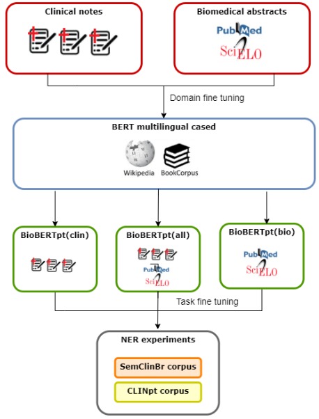

# BioBERTpt - A Portuguese Neural Language Model for Clinical Named Entity Recognition - Schneider et al. - 2020

## 📌 [Paper](https://www.aclweb.org/anthology/2020.clinicalnlp-1.7/)

# tl;dr

Our goal is to assess a deep contextual embedding model for Portuguese, so called BioBERTpt, to support clinical and biomedical NER. We transfer learned information encoded in a multilingual-BERT model to a corpora of clinical narratives and biomedical-scientific papers in Brazilian Portuguese.

[[GitHub repository]](https://github.com/HAILab-PUCPR/BioBERTpt)

# Introduction

In the clinical domain, NER can be used to identify clinical concepts, such as diseases, signs, procedures and drugs, supporting other data analysis as prediction of future clinical events, summarization, and **relation extraction between entities** (e.g., drug-to-drug interaction).

When applying the general word representation models in healthcare text mining, the characteristics of clinical texts are not considered, known to be noisy, with a different vocabulary, expressions, and word distribution ([Knake et al., 2016](https://bmcpediatr.biomedcentral.com/articles/10.1186/s12887-016-0592-z)).

Therefore, contextual word embedding models, like BERT, can be **fine-tuned**, i.e., **have their last layers updated to adapt to a specific domain, like clinical and biomedical, using domain-specific training data**. ([Ranti et al., 2020](https://arxiv.org/abs/2002.06670))

Several models were trained on clinical and biomedical corpora:

- word2vec model trained on biomedical corpora ([Pyysalo et al., 2013](https://bio.nlplab.org/pdf/pyysalo13literature.pdf))
- BioBERT - trained from scratch using scientific texts ([Lee et al., 2019](https://academic.oup.com/bioinformatics/article/36/4/1234/5566506))
- Clinical BERT - pre-trained model with clinical data ([Alsentzer et al., 2019](https://www.aclweb.org/anthology/W19-1909/))

All these studies used English corpora. Indeed, there are few studies in lower resources languages for the clinical domain.

In Portuguese:

- fastText model trained with clinical texts ([Lopes et al., 2019](https://www.aclweb.org/anthology/W19-5024/))
- CRF algorithm for the NER task ([de Souza et al., 2019](https://sol.sbc.org.br/index.php/sbcas/article/view/6269))
- Clinical word embedding model evaluated on Urinary Tract Infection disease identification ([Oliveira et al., 2019](https://www.researchgate.net/profile/Lucas_Oliveira9/publication/335364585_Learning_Portuguese_Clinical_Word_Embeddings_A_Multi-Specialty_and_Multi-_Institutional_Corpus_of_Clinical_Narratives_Supporting_a_Downstream_Biomedical_Task/links/5d5ffecf92851c619d6f3ceb/Learning-Portuguese-Clinical-Word-Embeddings-A-Multi-Specialty-and-Multi-Institutional-Corpus-of-Clinical-Narratives-Supporting-a-Downstream-Biomedical-Task.pdf))

The objective of this work is to **assess the performance of a domain specific attention-based model, BioBERTpt, to support NER tasks in Portuguese clinical narratives**.

# Methods

## Development of BioBERTpt

We fine-tuned three BERT-based models on Portuguese clinical and biomedical corpora, initialized with multilingual BERT weights provided by [Devlin et al. (2018)](https://arxiv.org/abs/1810.04805).

### 1. BioBERTpt(clin)

A model with clinical data, from the narratives of Brazilian hospitals.

In total, the clinical notes contain 3.8 million sentences with 27.7 million words.

### 2. BioBERTpt(bio)

A model with biomedical data, from scientific papers titles and abstracts, composed by documents from [Scielo](https://scielo.org/) and Pubmed databases about biological and health, resulting in 16.4 million words.

### 3. BioBERTpt(all)

A full version, i.e., using both clinical and biomedical data.

## NER experiments

Two NER experiments, using the following corpora:

1. SemClinBr ([Oliveira et al., 2020](https://github.com/pavalucas/paper-notes/blob/master/corpus/2020_SemClinBr.md)), a semantically annotated corpus for Portuguese clinical NER, containing 1,000 labeled clinical notes.
2. CLINpt ([Lopes et al., 2019](https://www.aclweb.org/anthology/W19-5024/)), a collection of 281 Neurology clinical case descriptions, with manually-annotated named entities.

We compare BioBERTpt with the already existing  contextual models:

- BERT multilingual uncased(cased)
- Portuguese BERT base(large) ([Souza et al., 2019](https://github.com/pavalucas/paper-notes/blob/master/named_entity_recognition/2020_NER_BERT_CRF.md))

# Discussion

### Effect of domain

By evaluating BioBERTpt, we found that the domain can influence the performance of BERT-based models, particularly for domains with unique characteristics such as medical. Our in-domain models achieved higher results for average metrics.

### Effect of the contextualized language model

The use of BERT-base models in our work had a positive impact on the results when compared to previous works with traditional machine learning algorithms and word embeddings for NER in Portuguese clinical text ([de Souza et al., 2019](https://sol.sbc.org.br/index.php/sbcas/article/view/6269); [Lopes et al., 2019](https://www.aclweb.org/anthology/W19-5024/)).

### Effect of language

The generic Portuguese BERT models ([Souza et al., 2019](https://github.com/pavalucas/paper-notes/blob/master/named_entity_recognition/2020_NER_BERT_CRF.md)) were outperformed by the BERT multilingual versions. This may be due to a local minima or the catastrophic forgetting.

- **Catastrophic forgetting**: it can happen during fine-tuning step, by overwriting previous knowledge of the model with new distinct knowledge, leading to a loss of information on lower layers ([Xu et al., 2019](https://arxiv.org/pdf/1911.00202.pdf))

This may have occurred since the linguistic characteristics of clinical texts are very different from the corpus used during pre-training phase of Portuguese BERT, a Web Corpus from 120,000 different Brazilian websites.

# Future work

We would like to explore larger transformers-based models in the clinical Portuguese domain and evaluate our model in different clinical NLP tasks, such as negation detection, summarization and de-identification.