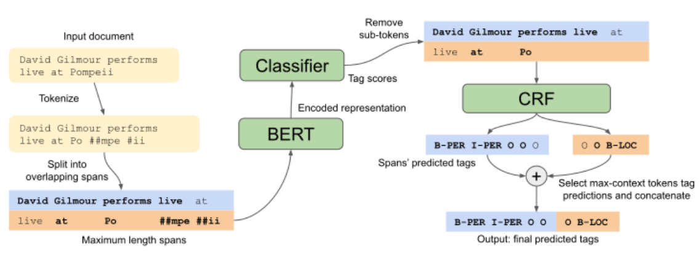

# Portuguese Named Entity Recognition using BERT-CRF - Souza et al - 2020

## 📌 [Paper](https://arxiv.org/pdf/1909.10649.pdf)

# tl;dr

We train Portuguese BERT models and employ a BERT-CRF architecture to the NER task on the Portuguese language, combining the transfer capabilities of BERT with the structured predictions of CRF. Our fine-tuning approach obtains new SOTA resultas on the HAREM I dataset.

# Introduction

Named entity recognition (NER) is the task of identifying text spans that mention named entities (NEs) and classifying them into predefined categories, such as person, organization, location.

Current state-of-the-art NER systems employ neural architectures that have been pre-trained on language modeling tasks.

Applying these techniques to the Portuguese language can be highly valuable, given that annotated resources are scarce, but unlabeled text data is abundant.

# Related Work

Neural network NER systems:

1. [Collobert et al (2011)](https://www.sciencedirect.com/science/article/abs/pii/S0920548912001080)
2. CharWNN model [(Santos and Guimaraes, 2015)](https://arxiv.org/abs/1505.05008)
3. LSTM-CRF architecture [(Lample et al, 2016)](https://arxiv.org/abs/1603.01360) used by ([Castro et al, 2019](https://www.researchgate.net/publication/326301193_Portuguese_Named_Entity_Recognition_using_LSTM-CRF); [de Araujo et al, 2018](https://link.springer.com/chapter/10.1007%2F978-3-319-99722-3_32); [Fernandes et al, 2018](https://paginas.fe.up.pt/~eco/pubs/2018/51_ANLP2018_RC_15.pdf))
4. Contextual embeddings + LSTM-CRF ([Santos et al, 2019](https://ieeexplore.ieee.org/abstract/document/8923652); [Castro et al, 2019](http://ceur-ws.org/Vol-2421/NER_Portuguese_paper_1.pdf))

# Model

## BERT-CRF for NER

The model architecture is composed of a BERT model with a token-level classifier on top followed by a Linear-Chain CRF.

1. For an input sequence of tokens, BERT outputs an encoded token sequence with hidden dimension.
2. The classification model projects each token's encoded representation to the tag space.
3. The output scores of the classification model are then fed to the CRF layer, whose parameters are a matrix of tag transitions.

## Feature-based and Fine-tuning approaches

Two transfer learning approaches:

- **Feature-based**: the BERT model weights are kept frozen and only the classifier model and CRF layer are trained. The classifier consists of a 1-layer BiLSTM followed by a Linear layer.
- **Fine-tuning**: the classifier is a linear layer and all weights, including BERT's, are updated jointly during training.

# Experiments

## BERT pre-trainings

We train Portuguese BERT models for the two models sizes defined in [Devlin et al. (2018)](https://arxiv.org/abs/1810.04805): BERT Base and BERT Large.

A cased Portuguese vocabulary of 30k subword units is generated from 200k random Portuguese Wikipedia articles.

For pre-training data, we use the [brWaC corpus](https://www.aclweb.org/anthology/L18-1686.pdf), which contains 2.68 billion tokens from 3.53 million documents and is the largest open Portuguese corpus to date.

## NER experiments

For training and evaluating Portuguese NER. we use the HAREM Golden Collections (GC) ([Santos et al., 2006](http://www.lrec-conf.org/proceedings/lrec2006/pdf/59_pdf.pdf); [Freitas et al., 2010](http://www.lrec-conf.org/proceedings/lrec2010/pdf/412_Paper.pdf))

Two subsets: First HAREM as training set and MiniHAREM as test set.

- First  HAREM: 129 documents and 95595 tokens
- MiniHAREM: 128 documents and 64853 tokens

The experiments are conducted on two scenarios: a Selective scenario, with 5 entity classes and a Total scenario, that considers all 10 classes.

# Results

Our proposed Portuguese BERT-CRF model outperforms the previous state-of-the-art (BiLSTM-CRF+FlairBBP), improving the F1-score by about 1 point on the selective scenario and by 4 points on the total scenario.

# Conclusion

We hope that by releasing our Portuguese BERT models, others will be able to benchmark and improve the performance of many other NLP tasks in Portuguese. Experiments with more recent and efficient models, such as RoBERTa and T5, are left for future work.