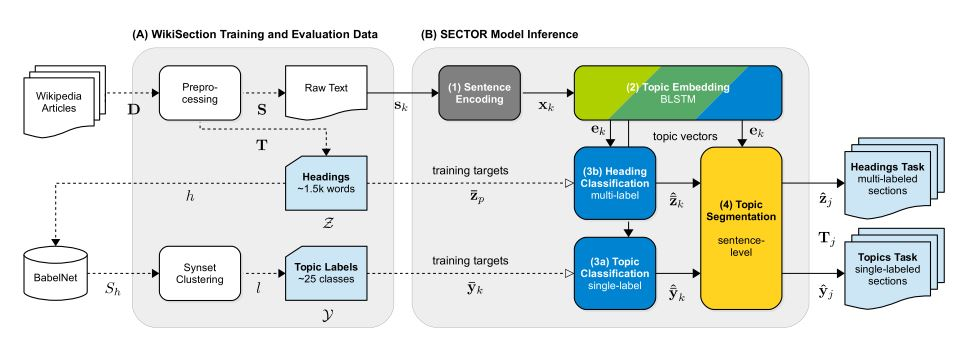
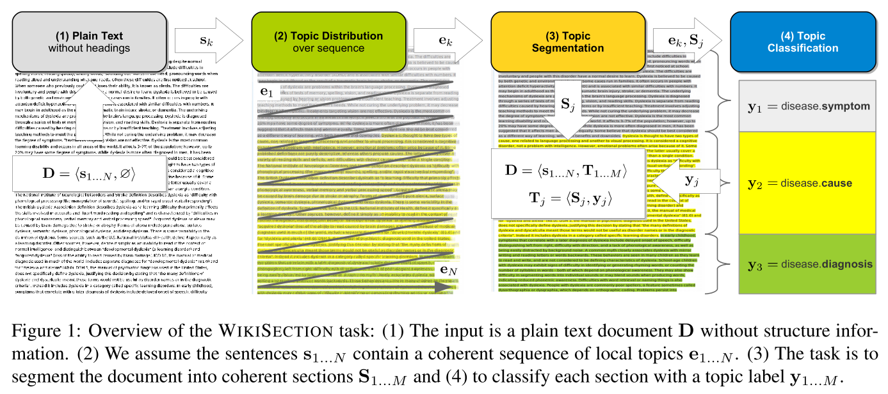
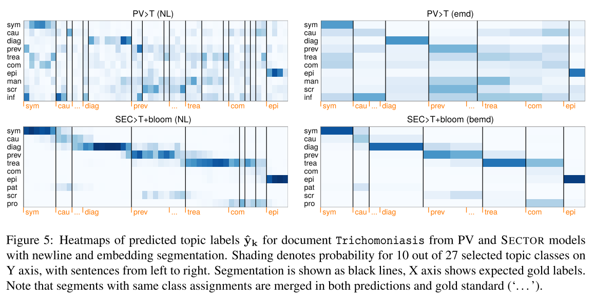

# SECTOR: A Neural Model for Coherent Topic Segmentation and Classification

## 📌 [Paper](https://arxiv.org/abs/1902.04793)

# tl;dr

SECTOR: a model to support machine reading systems by segmenting documents into coherent sections and assigning topic labels to each section.

# Introduction

**Motivation:**

- From a human perspective, it is mostly the authors themselves who help best to understand a text. Especially in long documents, an author thoughtfully designs a readable structure and guides the reader through the text by arranging topics into [coherent passages](https://www.aclweb.org/anthology/S16-2016/)
- In many cases, this structure is not formally expressed as section headings (e.g. in news articles, reviews, discussion forums) or it is structured according to domain-specific aspects (e.g. health reports, research papers, insurance documents)
- Ideally, systems for text analytics, such as [topic detection and tracking (TDT)](https://link.springer.com/chapter/10.1007/978-1-4615-0933-2_1), [text summarization](https://www.researchgate.net/publication/221603964_Topic_Segmentation_Algorithms_for_Text_Summarization_and_Passage_Retrieval_An_Exhaustive_Evaluation), [information retrieval (IR)](https://www.researchgate.net/publication/220479788_Applying_Machine_Learning_to_Text_Segmentation_for_Information_Retrieval) or [question answering (QA)](https://arxiv.org/abs/1805.03797) could access a document representation that is aware of both *topical* (i.e. latent semantic content) and *structural* information (i.e. segmentation) in the [text](https://arxiv.org/abs/1805.00791)

It is therefore important to understand topic segmentation and classification as a mutual task that requires to encode both topic information and document structure coherently.

In this article, we present **[SECTOR](https://github.com/sebastianarnold/SECTOR)**, an end-to-end model which learns an embedding of latent topics from potentially ambiguous headings and can be applied to entire documents to predict local topics on sentence level.

To the best of their knowledge, the combined task of segmentation and classification has not been approached on full document level before.

We introduce [WIKISECTION](https://github.com/sebastianarnold/WikiSection), a large novel dataset of **38k** articles from the English and German Wikipedia labeled with **242k** sections, original headings and normalized topic labels for up to 30 topics from two domains: *diseases* and *cities*.

# Related Work

Three main problems:

- Topic modeling
- Text segmentation
- Text classification

Our method unifies those strongly interwoven tasks and is the first to evaluate the combined topic segmentation and classification task using a corresponding dataset with long structured documents.

# Task Overview and Dataset

### Task Overview

### Dataset

For the evaluation of this task, we created WikiSection, a novel dataset containing a gold standard of 38k full-text documents from English and German Wikipedia comprehensively annotated with sections and topic labels.

Our dataset contains the article abstracts, plain text of the body, positions of all sections given by the Wikipedia editors with their original headings (e.g. "Causes | Genetic sequence") and a normalized topic label (e.g. disease.cause).

Initially, we expected articles to share congruent structure in naming and order. Instead, we observe a high variance with 8.5k distinct headings in the diseases domain and over 23k for English cities. A closer inspection reveals that Wikipedia authors utilize headings at different granularity levels, frequently copy and paste from other articles, but also introduce synonyms or hyponyms, which leads to a *vocabulary mismatch problem*.

As a result, the distribution of headings is heavy-tailed across all articles. Roughly 1% of headings appear more than 25 times while the vast majority (88%) appear 1 or 2 times only.

In order to use Wikipedia headlines as a source for topic labels, we contribute a normalization method to reduce the high variance of headings to few representative labels based on the clustering of Babel-Net synsets.

# SECTOR Model

We introduce SECTOR, a neural embedding model that predicts a latent topic distribution for every position in a document. Because we do not know the expected number of sections, we formulate the objective of our model on sentence level and later segment based on the predictions.

We approach two variations of this task:

- WikiSection-topics: we choose a single topic label out of a small number of normalized topic labels (~25 classes). However, from this simplified classification task arises an entailment problem, because topics might be hierarchically structured. For example, a section with heading "Treatment | Gene Therapy" might describe genetics as a subtopic of treatment.
- WikiSection-headings: an extended task (~1.5k words) to capture ambiguity in a heading.It further eliminates the need for normalized topic labels.

Our SECTOR architecture consists of four stages: sentence encoding, topic embedding, topic classification and topic segmentation.

## Sentence Encoding

The first stage of our SECTOR model transforms each sentence from plain text into a fixed-size sentence vector which serves as input into the neural network layers.

- **Bag-of-words encoding**: As a baseline, we compose sentence vectors using a weighted bag-of-words scheme.
- **Bloom filter embedding**: For large vocabulary and long documents, input matrices grow too large to fit into GPU memory, especially with larger batch sizes. Therefore we apply a compression technique for sparse sentence vectors based on [Bloom filter](https://arxiv.org/abs/1706.03993).
- **Sentence embeddings**: We use the strategy of [Arora et al. (2017)](https://openreview.net/pdf?id=SyK00v5xx) to generate a distributional sentence representation based on pre-trained word2vec embeddings.

## Topic Embedding

We model the second stage in our architecture to produce a dense distributional representation of latent topics for each sentence in the document. We use two layers of [LSTM](https://www.researchgate.net/publication/13853244_Long_Short-term_Memory) with [forget gates](https://www.researchgate.net/publication/12292425_Learning_to_Forget_Continual_Prediction_with_LSTM) connected to read the document in [forward and backward direction](https://www.cs.toronto.edu/~graves/preprint.pdf). We feed the LSTM outputs to a ‘bottleneck’ layer with tanh activation as topic embedding.

## Topic Classification

The third stage in our architecture is the output layer that decodes the class labels. To learn model parameters required by the embedding, we need to optimize the full model for a training target.

- **WikiSection-topics task**: we use a simple one-hot encoding of the topic labels with a softmax activation output layer.
- **WikiSection-headings task**: we encode each heading as lowercase bag-of-words vector, e.g. {gene, therapy, treatment}. We then use a sigmoid activation function.

## Topic Segmentation

In the final stage, we leverage the information encoded in the topic embedding and output layers to segment the document and classify each section

### Baseline segmentation

As a simple baseline method, we use prior information from the text and split sections at newline characters (NL). Additionally, we merge two adjacent sections if they are assigned the same topic label after classification.

### Using deviation of topic embeddings for segmentation

All information required to classify each sentence in a document is contained in our dense topic embedding matrix. We are now interested in the vector space movement of this embedding over the sequence of sentences. Therefore, we apply a number of transformations adapted from [Laplacian-of-Gaussian edge detection on images](https://www.researchgate.net/publication/2336485_Edge_Detection_Techniques_-_An_Overview) to obtain the magnitude of embedding deviation (emd) per sentence.

### Improving edge detection with bidirectional layers

We adopt the approach of [Sehikh et al. (2017)](https://hal.archives-ouvertes.fr/hal-01599682/document), who examine the difference between forward and backward layer of an LSTM for segmentation. However, our approach focuses on the difference of left and right topic context over time steps *k*, which allows for a sharper distinction between sections.

---

After segmentation, we assign each segment the mean class distribution of all contained sentences.

# Evaluation

We conduct three experiments to evaluate the segmentation and classification task.

1. WikiSection-topics experiment comprises segmentation and classification of each section with a single topic label out of a small number of clean labels (25–30 topics)
2. WikiSection-headings experiment extends the classification task to multi-label per section with a larger target vocabulary (1.0k–2.8k words)
3. Experiment to see how SECTOR performs across existing segmentation datasets

### Text segmentation models

We compare SECTOR to common text segmentation methods as baseline, [C99](https://www.aclweb.org/anthology/A00-2004.pdf) and [TopicTiling](https://www.aclweb.org/anthology/W12-3307/) and the [SOTA TextSeg segmenter](https://www.aclweb.org/anthology/N18-2075/).

### Classification model

We compare SECTOR to existing models for single and multi-label sentence classification. Because we are not aware of any existing method for combined segmentation and classification, we first compare all methods using given prior segmentation from newlines in the text and then additionally apply our own segmentation strategies for plain text input.

For the experiments, we train a [Paragraph Vectors](https://arxiv.org/abs/1405.4053) model using all sections of the training sets.

### Quality measures

- [Probabilistic Pk error score](https://link.springer.com/article/10.1023/A:1007506220214)
    - Measure text segmentation at sentence level
    - Calculate the probability of a false boundary in a window of size *k*, lower numbers mean better segmentation
    - As relevant section boundaries we consider all section breaks where the topic label changes
- *Micro-averaged F1* score for single-label or *Precision@1* for multi-label classification
    - Measure classification performance on section level by comparing the topic labels of all ground truth sections with predicted sections
    - Select the pairs by matching their positions using maximum boundary overlap
- Mean Average Precision (MAP)
    - Evaluate the average fraction of true labels ranked above a particular label

## Results

- SECTOR outperforms existing classifier
- Topic embeddings improve segmentation
- Bloom filters on par with word embeddings
- Topic embeddings perform well on noisy data

## Discussion and Model Insights

SECTOR captures latent topics from context:

# Future Work

We see an exciting future application of SECTOR as a building block to extract and retrieve topical passages from unlabeled corpora, such as medical research articles or technical papers. One possible task is [WikiPassageQA](https://arxiv.org/abs/1805.03797), a benchmark to retrieve passages as answers to non-factoid questions from long articles.