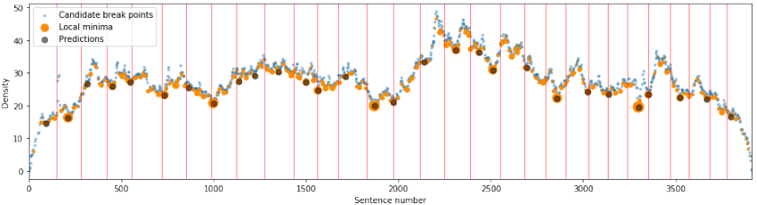

# Chapter Captor: Text Segmentation in Novels - Pethe et al - 2020

## 📌 [Paper](https://www.aclweb.org/anthology/2020.emnlp-main.672/)

# tl;dr

We investigate the task of predicting chapter boundaries, as a proxy for the general task of segmenting long texts.

# Introduction

Text segmentation is a fundamental task in NLP, which seeks to partition texts into sequences of coherent segments or episodes. It plays an important role in many NLP applications including summarization, information retrieval, and question answering.

In novels and related literary works, authors often define such coherent segments by means of sections and chapters.

We develop methods for extracting ground truth chapter segmentation from Project Gutenberg texts, and use this as training/evaluation data to build text segmentation systems to predict the natural boundaries of long narratives.

### Contributions

- **Project Gutenberg Chapter Segmentation Resource**: To create a ground-truth data set for chapter segmentation, we developed a hybrid approach (neural model with a regular expression based rule matching system) to recognizing chapter formatting. Our data set consists of 9,126 English fiction books in Gutenberg corpus.
- **Local Methods for Chapter Segmentation**: We develop two distinct approaches for predicting the location of chapter breaks
- **Global Break Prediction using Optimization**: By incorporating length criteria into the desired optimization criteria and using dynamic programming to find the best global solution enables us to control how important it is to keep the segments equal.

[[code and links to data]](https://github.com/cpethe/chapter-captor)

# Header Annotation

## Data

In the absence of human-annotated gold standard data with annotated front matter and chapter headings, we derive silver-standard ground truth from Project Gutenberg.
We identify 8,400 English fiction books available in HTML format, and extract (noisy) HTML header elements from these books.

## BERT Inference

We fine-tune a pretrained [BERT model](https://arxiv.org/abs/1810.04805) with a [token classification head](https://huggingface.co/transformers/model_doc/bert.html#bertfortokenclassification), to identify the lines which are likely to be headers.

**Training:** For each header extracted from the Project Gutenberg HTML files, we append content from before and after the header to generate training sequences of fixed length.

**Inference:** We tokenize the text using the custom BERT Cased Tokenizer, and use the model to generate a confidence score for each token. We choose the top 10% tokens with the highest confidence scores, and use the lines containing these tokens as potential header candidates for regex matching.

## Regex Rule Matching

We compile a list of regular expressions for constituent elements in chapter headings:

- Keywords like 'Chapter', 'Section', 'Volume'
- Title (uppercase and mixed case)
- and others

For every potential header candidate generated using the BERT model, we pick the best matching rule, and discard the candidate if there is no matching rule.

## Missing Chapter Hunt

In this stage, we search for chapter headings the BERT model may have missed. For each matched rule that contains a number in some format, we search for chapter headings in the same format with the missing number.

## Refinement

We get rid of false positive matches, by removing headers between consecutive chapter numbers, which do not match the same rule.

# Local Methods for Segmentation

After removing all explicit signals of chapter boundaries from the texts, we now evaluate algorithms for segmenting text into chapters.

We formulate our **task** as follows:

- **Given**: Sentences in the book, and *P*, the number of break to insert
- **Compute**: *P* break points corresponding to chapter breaks

## Weighted Overlap Cut (WOC)

Our hypothesis is that there will be fewer words in common across a break point separating two chapters, as compared to words within the same chapter.

Considering sentences as nodes, and common words as edges, we can compute the density of a potential break point as the sum of the number of edges going across it, weighted by their distance from the break point. As per our hypothesis, we expect the break point between two chapters to appear as local minima in density as a function of sentence number.

We have taken the approach of computing sentence-level density and then restricting potential break points to points between paragraphs.

## BERT for Break Prediction (BBP)

We fine-tune a pre-trained BERT model for the Next Sentence Prediction task, to classify pairs of sequences in which the second one is a coherent continuation of the first.

Intuitively, for text sequences which are separated by chapter break, we expect the second sequence to not be a continuation of the first, i.e. the output label should be 0. Otherwise, the output label should be 1, denoting sentences within the same chapter.

## Evaluation

We evaluate our algorithms using three metrics: [Pk](https://www.cs.cmu.edu/~aberger/pdf/ml.pdf), [WindowDiff](https://bailando.berkeley.edu/papers/pevzner-01.pdf) and F1 score.

We compare our approaches against the following baselines:

- **Equidistant**
- [**TextTiling**](https://dl.acm.org/doi/pdf/10.3115/981732.981734)
- [**C99**](https://dl.acm.org/doi/pdf/10.5555/974305.974309)
- **Perceptron**: baseline perceptron model as described in [Badjatiya et al. (2018)](https://arxiv.org/pdf/1808.09935v1.pdf)
- **LSTM**: neural model as described in [Badjatiya et al. (2018)](https://arxiv.org/pdf/1808.09935v1.pdf)

Our models outperform the baselines on all metrics, with the BERT model for break prediction model giving the best results.

# Global Break Prediction

In the approaches described above, we simply select the highest scoring *P* points.The problem is that the model may place two breaks close to one another, when realistically, chapter breaks are spaced fairly apart in practice.

We propose a dynamic programming approach, in order to incorporate a weight for keeping the chapter breaks equidistant.

We add an additional parameter *alpha*, which determines the importance of the confidence scores as compared to equidistant breaks. *Alpha* ranges from 0 to 1, where 1 indicates that full weight is given to confidence scores, and 0 indicates that full weight is given to keeping the breaks equidistant.

For both models, *alpha = 0.8* shows the best performance.

## Estimating the Number of Breaks

The models described above require the number of chapter boundaries to be specified. We address the independent question of estimating how many chapter breaks to insert.

We use a regression model to predict the number of breaks, with the number of candidate break points and the total number of sentences in the book, as features. We predict the number of chapter breaks using this regression, and further evaluate global break prediction with *alpha = 0.8*.

# Future Work

Potential future work includes combining the neural and cut-based approaches into a stronger method.

Further, it would be interesting to do a deeper dive into variations of author strategies in chapterization, focusing more intently on books with large number of short chapters as being more reflective of episode boundaries.